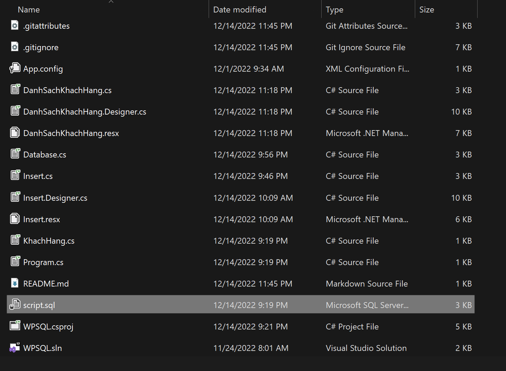

# SQL(Quản trị khách hàng)
 IT008.N12
 Nguyễn Trọng Ninh - 21521252

## Mục lục

 [I. Hướng dẫn sử dụng](#HDSD)
 [II. Tính năng](#Tinhnang)
 [III. Tác giả](#Tacgia)
 [IV. Người hướng dẫn](#Nguoihuongdan)
 [V. Tổng kết](#Tongket)

<!-- HDSD -->

## I. Hướng dẫn sử dụng
Kinh tế ngày càng phát triển, áp lực công việc cũng ngày càng lớn kéo theo nhu cầu giải trí của con người cũng ngày càng tăng lên, trong đó xem phim là hình thức được nhiều người lựa chọn. Điều này là một tiềm năng phát triển rất lớn và được nhiều công ty khai thác. Một vấn đề lớn được đặt ra là việc quản lý các rạp phim sao cho hiệu quả, chính xác, tránh được rủi ro không nên có. Hiểu được điều này, nhóm quyết định xây dựng một ứng dụng hỗ trợ các rạp chiếu phim trong việc quản lý, tận dụng những công nghệ tiên tiến để phát triển, mục tiêu hướng đến chính là nâng cao trải nghiệm người dùng về cả giao diện lẫn tốc độ xử lý, kèm theo đó là những tính năng mở rộng phù hợp với thực tiễn.
<!-- LOGO CINEMA -->

<!-- Tính năng -->

## II. Tính năng
* Quản lý đăng nhập, hỗ trợ việc khôi phục tài khoản cho người dùng khi quên mật khẩu.

* Với vai trò quản lý (admin):
  * Quản lý suất chiếu phim
  * Quản lý suất chiếu phim
  * Quản lý phim
  * Quản lý sản phẩm
  * Quản lý nhân sự
  * Quản lý khách hàng
  * Thống kê
  * Quản lý lịch sử hàng hoá
  * Quản lý voucher khách hàng
  * Tiếp nhận và xử lý sự cố trang thiết bị

* Với vai trò nhân viên:
  * Xem thông tin chi tiết của các suất chiếu, cho phép chọn suất chiếu.
  * Xem sơ đồ ghế của phòng chiếu, thông tin chi tiết của ghế, cho phép chọn ghế.
  * Xem thông tin những sản phẩm bán kèm đang được bán tại rạp, cho phép đặt kèm theo vé hoặc mua riêng theo nhu cầu khách hàng.
  * Cho phép nhập thông tin khách mua hàng, thanh toán và in hoá đơn sản phẩm.
  * Thêm, huỷ, cập nhật thông tin sự cố các thiết bị phòng chiếu.
 

<!-- TÁC GIẢ -->

## III. Tác giả

* [Nguyễn Trọng Ninh](https://github.com/Ninhnon)

<!-- NGƯỜI HƯỚNG DẪN -->

## IV. Người hướng dẫn
* Giảng viên: Nguyễn Tấn Toàn

<!-- TỔNG KẾT -->

## V. Tổng kết

Cảm ơn bạn đã quan tâm!

---

<a href="#Top">Quay lại đầu trang</a>

