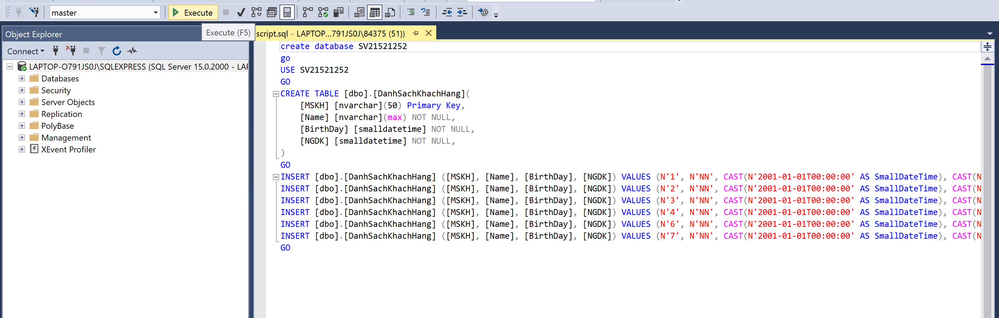

# SQL(Quản trị khách hàng)
 IT008.N12

 Nguyễn Trọng Ninh - 21521252

## Mục lục

 [I. Hướng dẫn sử dụng](#HDSD)

 [II. Tính năng](#Tinhnang)
 
 [III. Tác giả](#Tacgia)
 
 [IV. Người hướng dẫn](#Nguoihuongdan)
 
 [V. Tổng kết](#Tongket)

<!-- HDSD -->

## I. Hướng dẫn sử dụng
Đầu tiên, bạn tìm trong source file [script.sql](), mở file trong Microsoft SQL Server Management Studio.

Sau đó trong giao diện kết nối bạn chọn server bạn muốn lưu trữ dữ liệu, Chú ý lưu tên server lại. Ví dụ ở đây ta lưu tên server : LAPTOP-O791JS0J\SQLEXPRESS.

Sau khi đã mở được file bạn click chuột vào nội dung của file khi đó bạn chạy bằng cách chọn vào button "Execute" (Hoặc nhấn F5 trên bàn phím).

Quay lại folder chứa dự án, Bạn mở file [WPSQL.sln]() sau đó trong phần Solution Explorer bạn tìm file [App.config]() mở file trong hình.

Bây giờ bạn chỉ cần thay đổi nội dung ở phần Data Source với tên server SQL bạn đã lưu.

<!-- Tính năng -->

## II. Tính năng

* Hiển thị danh sách khách hàng(MSKH, Họ và tên, Ngày sinh, Ngày đăng ký)
* Chọn để hiển thị thông tin khách hàng
* Chỉnh sửa các thông tin khách hàng(ngoại trừ MSKH)
* Thêm khách hàng
* Xóa khách hang

<!-- TÁC GIẢ -->

## III. Tác giả

* [Nguyễn Trọng Ninh](https://github.com/Ninhnon)

<!-- NGƯỜI HƯỚNG DẪN -->

## IV. Người hướng dẫn
* Giảng viên: Nguyễn Tấn Toàn

<!-- TỔNG KẾT -->

## V. Tổng kết
Đây là bài tập: SQL(Quản trị khách hàng) cơ bản của mình nên có gì thiếu sót và đóng góp ý kiến, mong các bạn có thể trao đổi với mình qua mail: [21521252@gm.uit.edu.vn]()

Cảm ơn bạn đã quan tâm!

---

<a href="#Top">Quay lại đầu trang</a>

